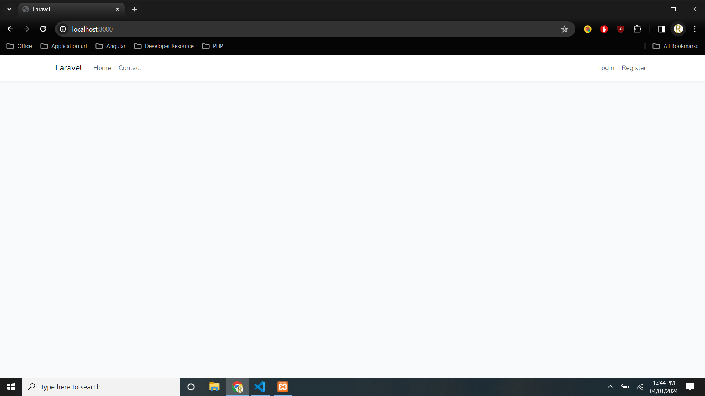
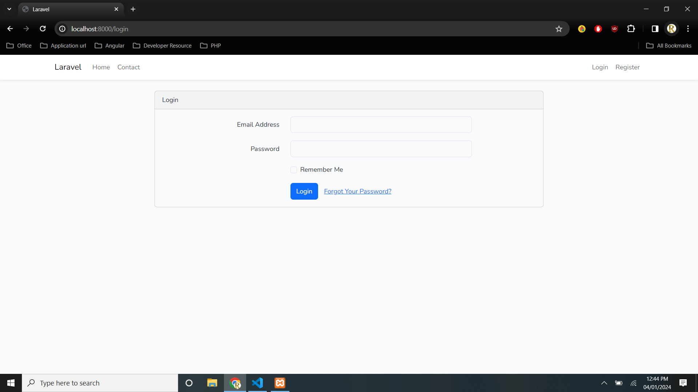
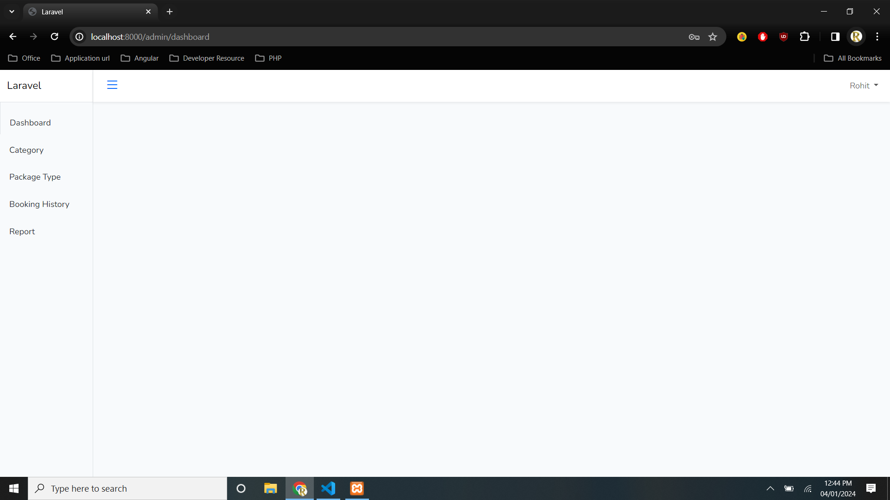
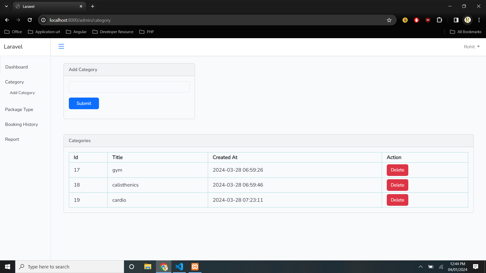
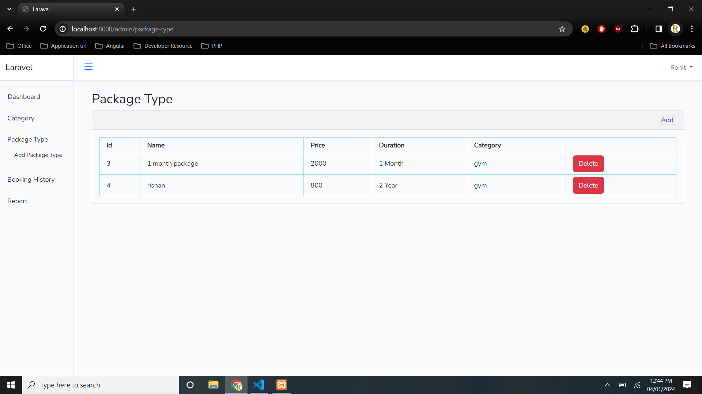
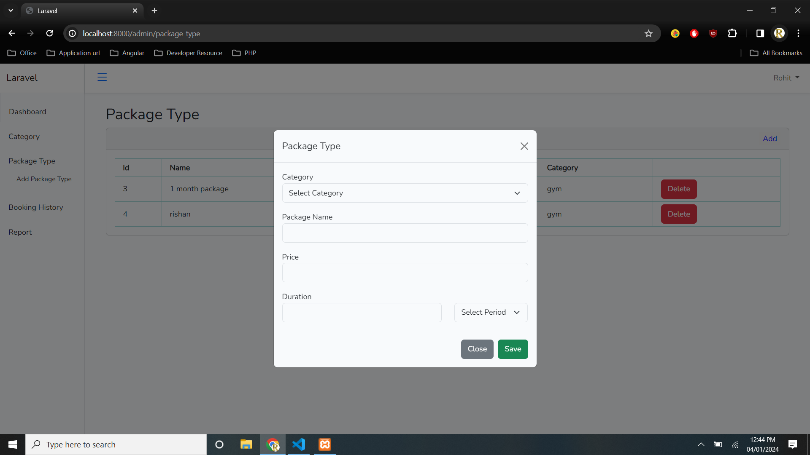
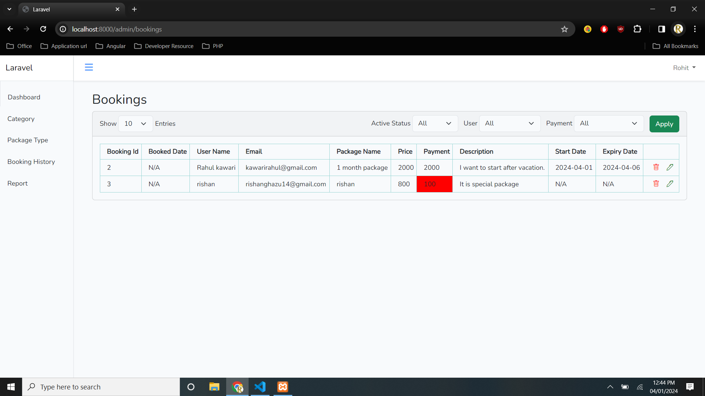
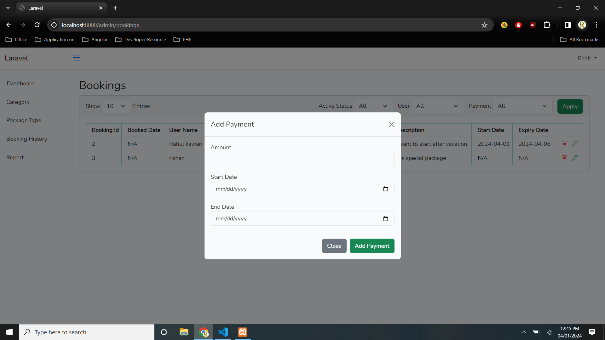

## Configuration
php : 8.0.30  
composer : 2.7.2  
node: 14.20.0

## Project Setup
a. composer install
b. npm install
c. in one cmd: php artisan serve
d. in another: npm run dev
e. change sql connection(.env file)
f. change database name
g. run migration scription: php artisan migrate

## Packages used
a. laravel/ui

## Demo

## Pages

### Home

### Login

### Dashboard

### Category

### Package

#### Package Form

### Booking

#### Booking Form

